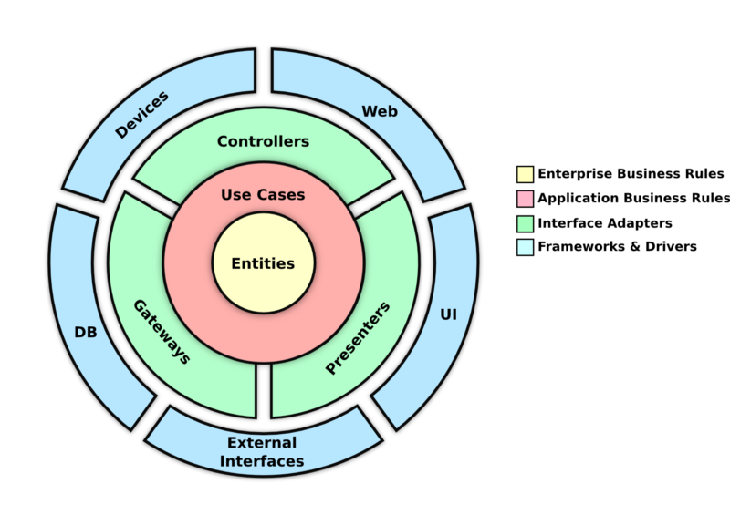
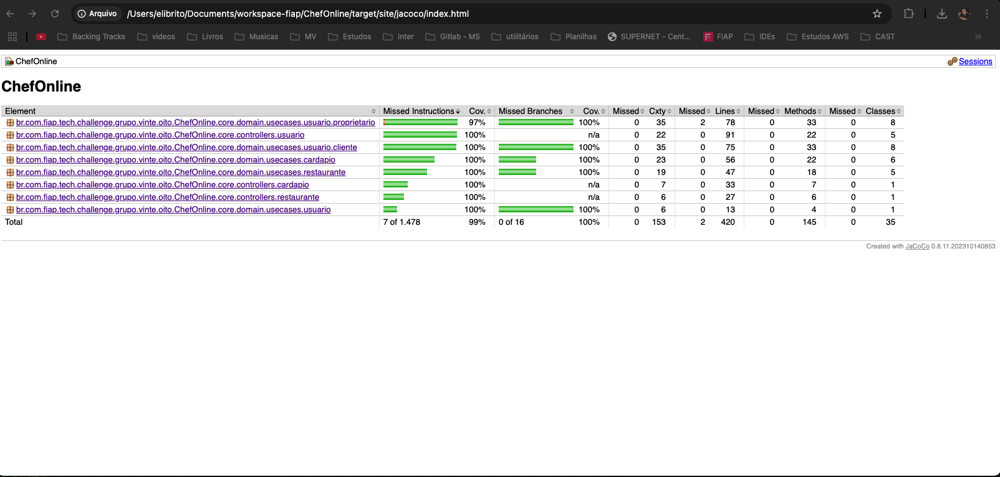

# Tech Challenge - Fase 2: Sistema de Gestão para Restaurantes

Este projeto tem como objetivo desenvolver o backend de um sistema de gestão compartilhado entre restaurantes da região. A aplicação é focada na gestão de **usuários**, com autenticação, autorização e integração com banco de dados relacional, utilizando **Spring Boot** e **Docker Compose**.

## 📌 Contexto

Devido ao alto custo de sistemas individuais, diversos restaurantes decidiram unificar esforços e criar uma solução colaborativa. A Fase 1 é voltada para a criação de uma **API REST** funcional e escalável para o gerenciamento de usuários.

## 🏗️ Arquitetura

O projeto foi desenvolvido seguindo os princípios da **Clean Architecture**, garantindo:
- Separação clara de responsabilidades
- Independência de frameworks
- Testabilidade
- Baixo acoplamento
- Alta coesão

### Diagrama da Arquitetura



## 🚀 Funcionalidades

- **Gerenciamento de Proprietários**:
    - Criação de novos proprietários
    - Consulta de proprietários cadastrados
    - Atualização de informações de proprietários
    - Exclusão de proprietários
    - Atualização de senha de proprietários

- **Gerenciamento de Clientes**:
    - Cadastro de novos clientes
    - Consulta de clientes
    - Atualização de dados
    - Remoção de cadastro

- **Gerenciamento de Restaurantes**:
    - Cadastro de restaurantes
    - Consulta de estabelecimentos
    - Atualização de informações
    - Remoção de restaurantes

- **Gerenciamento de Item de Cardápio**:
    - Criação de itens
    - Consulta de itens de cardápio
    - Atualização de itens de cardápio
    - Remoção de itens de cardápio

- **Segurança**:
    - Autenticação de usuários
    - Autorização baseada em perfis
    - Validação de dados de entrada
    - Hashing de senhas

- **Documentação da API**:
    - Integração com **SpringDoc OpenAPI** para documentação interativa

## 🔧 Tecnologias Utilizadas

### Backend
- **Java 21**: Linguagem de programação principal
- **Spring Boot 3.4.5**: Framework para desenvolvimento
    - Spring Web: Endpoints RESTful
    - Spring Data JPA: Persistência de dados
    - Spring Security: Segurança e autenticação
    - Spring Validation: Validação de dados

### Qualidade e Testes
- **JUnit 5**: Framework de testes
- **Mockito**: Framework para mocks em testes
- **JaCoCo**: Cobertura de código
    - Configurado para garantir mínimo de 80% de cobertura

### Relatório de Cobertura de Testes



### Build e Deploy
- **Maven**: Gerenciamento de dependências e build
- **Docker**: Containerização
- **Docker Compose**: Orquestração de containers

## 📊 Métricas de Qualidade

- Cobertura de testes: > 80%
- Testes unitários implementados para:
    - Controllers
    - Use Cases
    - Services
    - Repositories
    - Domain Models

## 🚀 Como Executar

1. Clone o repositório
2. Execute o Docker Compose:
```bash
docker-compose up -d
```
3. Execute a aplicação:
```bash
./mvnw spring-boot:run
```

## 📚 Documentação

A documentação da API pode ser acessada em:
- Swagger UI: `http://localhost:8080/swagger-ui.html`
- OpenAPI JSON: `http://localhost:8080/v3/api-docs`

## 🧪 Executando os Testes

```bash
./mvnw test
```

Para gerar o relatório de cobertura do JaCoCo:
```bash
./mvnw verify
```
O relatório será gerado em: `target/site/jacoco/index.html`

## 📄 Documentação Técnica

Para mais detalhes sobre a arquitetura e informações técnicas do projeto, acesse a documentação completa no link abaixo:

[Documentação Técnica](https://drive.google.com/file/d/1KuWEPYWbWT9UJHHOXqJ8jp62MULUqBfZ/view?usp=sharing)

### Logging
- **SLF4J com Logback**: Para registro de logs e monitoramento da aplicação.

## 📂 Estrutura do Projeto

- `controllers`: Contém os controladores REST responsáveis por expor os endpoints.
- `services`: Contém a lógica de negócios da aplicação.
- `dtos`: Contém os objetos de transferência de dados (Data Transfer Objects).
- `repositories`: Contém as interfaces para acesso ao banco de dados.
- `exceptions`: Contém as classes de tratamento de exceções personalizadas.

## 📖 Endpoints Principais

### **ClienteController**
- **`POST /v1/clientes`**: Cria um novo cliente no sistema.
- **`GET /v1/clientes`**: Retorna a lista de todos os clientes cadastrados com paginação.
- **`GET /v1/clientes/{id}`**: Busca os detalhes de um cliente específico pelo ID.
- **`PUT /v1/clientes/{id}`**: Atualiza as informações de um cliente existente.
- **`DELETE /v1/clientes/{id}`**: Remove um cliente do sistema pelo ID.

### **ProprietarioController**
- **`POST /v1/proprietarios`**: Cria um novo proprietário no sistema.
- **`GET /v1/proprietarios`**: Retorna a lista de todos os proprietários cadastrados com paginação.
- **`GET /v1/proprietarios/{id}`**: Busca os detalhes de um proprietário específico pelo ID.
- **`PUT /v1/proprietarios/{id}`**: Atualiza as informações de um proprietário existente.
- **`DELETE /v1/proprietarios/{id}`**: Remove um proprietário do sistema pelo ID.
- **`PATCH /v1/proprietarios`**: Atualiza a senha de um proprietário com base no login e CNPJ.

### **LoginController**
- **`POST /v1/auth/login`**: Realiza a autenticação de um usuário e retorna um token JWT.
- **`POST /v1/auth/refresh`**: Gera um novo token JWT com base em um token de refresh válido.

## 🛠️ Como Executar

1. Certifique-se de ter o **Java 21** e o **Maven** instalados.
2. Clone o repositório.
3. No terminal, execute:
   ```bash
   mvn spring-boot:run

1. Acesse a aplicação em `http://localhost:8080`.

🧑‍💻 Autores  
Projeto desenvolvido pelo grupo 28 no desafio técnico da FIAP.

**Membros da equipe:**
- Dhebbora Leane Bezerra de Vasconcelos
- Eli Leite de Brito Filho
- Emerson Leonardo Oliveira de Lira
- Lucas de Medeiros França Romero
- Tatiana Cruz Florentino